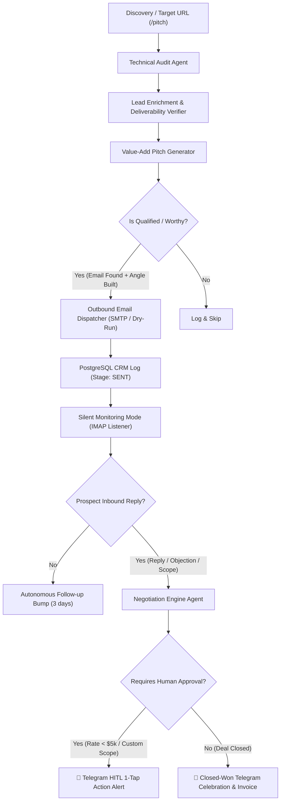

# 🛰️ Autonomous Outreach Engine — Problem Diagnosis & Autopilot Architecture

## 1. Executive Summary & Problem Diagnosis

### Root Causes Identified
1. **Disconnected Discovery & Outreach**: The scheduler's background discovery job (`run_discovery_job`) scraped and registered companies into the PostgreSQL database, sent a Telegram notice ("Found 15 new companies"), but **never invoked the outreach pipeline** on them. The companies remained in the database un-audited and un-pitched.
2. **Missing Email Dispatch Node in Pipeline**: The LangGraph workflow (`workflow/graph.py`) ended pitch generation at `DRAFTED` status and routed directly to the negotiation/alert handler. There was **no automated outbound email sender node** inside the graph.
3. **Interactive Telegram `/pitch` Only Outputting Text**: The Telegram bot `/pitch <url>` command only generated an offline pitch snippet and returned it as a markdown preview, without extracting leads, registering CRM entities, or dispatching outbound emails.
4. **Intrusive Draft Alerting**: The system was designed to require manual intervention/drafting review instead of operating with full agency and sending directly to worthy leads.

---

## 2. Autonomous Autopilot Architecture

The system has been upgraded to **Full Autopilot Outreach**:
- **Automatic Prospect Evaluation & Pitching**: When a company is discovered or submitted via `/pitch <url>`, the agent performs the technical diagnostic, extracts the founder/CTO email, verifies deliverability, generates the value-add pitch, and **autonomously dispatches the outbound email**.
- **Silent Outbound Operation**: Routine outbound drafting and sending occurs silently in the background without interrupting you.
- **Trigger-Only Escalations**: The agent reaches back to you **only** when:
  1. A prospect **replies or expresses interest** (`REPLIED`, `NEGOTIATING`, `COUNTER_OFFERED`).
  2. Rate negotiation exceeds defined guardrails (`HITL_HANDOVER` with 1-tap Telegram action buttons).
  3. A contract or retainer is agreed upon (`CLOSED_WON` celebration & auto-invoicing).



---

## 3. Key Components Modified

| Component | File | Changes Made |
| :--- | :--- | :--- |
| **Pipeline Graph** | [`workflow/graph.py`](file:///mnt/c/Users/USER/Documents/outreach-agent/workflow/graph.py) | Added `node_email_dispatcher` connecting `pitch_generator` ➔ `email_dispatcher` ➔ `negotiation_handler`. Auto-dispatches emails to verified leads and records `EmailSendLog`. |
| **Scheduler Daemon** | [`workflow/scheduler.py`](file:///mnt/c/Users/USER/Documents/outreach-agent/workflow/scheduler.py) | Added `run_pending_outreach_job()` and updated `run_discovery_job()` so newly registered prospects are immediately audited and pitched. Upgraded follow-ups to dispatch bump emails. |
| **Telegram Bot** | [`tools/telegram_bot.py`](file:///mnt/c/Users/USER/Documents/outreach-agent/tools/telegram_bot.py) | Upgraded `/pitch <url>` to execute the full autonomous pipeline and send emails directly. Added `/autopitch <niche>` and `/queue` commands. |
| **CLI Engine** | [`main.py`](file:///mnt/c/Users/USER/Documents/outreach-agent/main.py) | Added `autopitch` CLI command and updated `run` with `--send/--no-send` flag (default `--send`) and delivery status reporting. |
| **Configuration** | [`config.py`](file:///mnt/c/Users/USER/Documents/outreach-agent/config.py) | Added `auto_send_outreach = True`, `max_auto_pitches_per_discovery_cycle = 5`, and `alert_on_outbound_send = False`. |
| **Test Suite** | [`tests/test_autonomous_outreach.py`](file:///mnt/c/Users/USER/Documents/outreach-agent/tests/test_autonomous_outreach.py) | Added 4 comprehensive tests verifying automated dispatch, manual fallback, Telegram execution, and silent notification behavior. |

---

## 4. How to Operate & Monitor

### 1. Run Autonomous Daemon in Background
```bash
python main.py daemon
```
- Continuously polls IMAP for incoming replies (every 15m).
- Periodically discovers new prospects and autonomously pitches the top qualified candidates.
- Listens on Telegram for interactive commands and 1-tap HITL decisions.

### 2. Manual Single Prospect Pitching via CLI
```bash
python main.py run -u https://docs.copilotkit.ai -n CopilotKit
```

### 3. Immediate Autonomous Batch Pitching
```bash
python main.py autopitch --limit 5
```

### 4. Telegram Commands
- `/pitch https://example.com` ➔ Runs full pipeline, audits, finds email, and dispatches pitch.
- `/autopitch AI devtools` ➔ Discovers and sends pitches to top qualified companies.
- `/stats` ➔ Pipeline summary and active conversation counts.
- `/queue` ➔ Recent outreach dispatches and their CRM stages.
